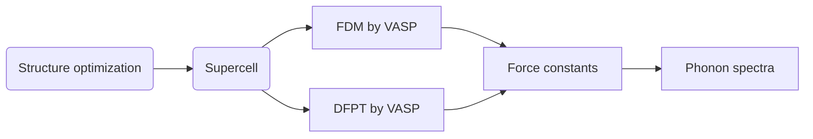

Phonons are quasiparticles representing the collective excitations of a crystal structure, describing the quantized modes of lattice vibrations that follow Bose-Einstein statistics. They are closely related to the thermodynamic properties of crystals. Therefore, calculating the phonon dispersion relations, or phonon spectra, is of great significance. This process involves obtaining the necessary force constants from first-principles (FP) calculations, followed by further processing and computations using tools like Phonopy. Two common FP methods for this purpose are the **finite displacement method (FDM)** and **density functional perturbation theory (DFPT)**.



Here I’m gonna use monolayer molybdenum disulfide (MoS₂) as an example to elaborate on the process:

---

#### 1. Structure optimization

Perform high-precision structure optimization of the initial unit cell, which can be from some tools like [ASE](https://wiki.fysik.dtu.dk/ase/) , optimizing both **lattice constants** and **atomic positions**.





```text
INCAR tag [ISIF]:
2: Keep lattice constants, and only optimize atomic positions;
3: The lattice constants, atomic positions, and volume are all optimized;
4: The lattice constants and atomic positions are optimized, but the volume does not.
```

> ##### WARNING
>
> Using `ISIF=3` for relaxation, which is unsuitable for 2D systems with vacuum as it may collapse
> the cell. Recommend using `ISIF=4` to keep cell volume constant while relaxing lateral lattice
> parameters.
> {: .block-warning }





```bash
Global Parameters
ISTART =  0            # Read existing wavefunction, if there
ISPIN  =  1            # Non-Spin polarised DFT
ICHARG =  2            # The initial guess charge density is generated by superposition of atomic charge density

LREAL  =  Auto         # Projection operators: False, important for phonon dispersion

ENCUT  =  650          # Cut-off energy for plane wave basis set, in eV
PREC   =  Accurate     # Precision level: Normal or Accurate, set Accurate when perform structure lattice relaxation calculation
LWAVE  = .FALSE.       # Write WAVECAR or not
LCHARG = .FALSE.       # Write CHGCAR or not
ADDGRID= .TRUE.        # Increase grid, helps GGA convergence

Electronic Relaxation
ISMEAR =  -5           # Gaussian smearing, metals:1
SIGMA  =  0.05         # SIGMA is ignored for the tetrahedron method when ISMEAR = -5
ALGO   =  N            # To specify the electronic minimisation algorithm
NELM   =  120          # Max electronic SCF steps
NELMIN =  6            # Min electronic SCF steps
EDIFF  =  1E-06        # SCF energy convergence, in eV
# GGA  =  PS           # PBEsol exchange-correlation

Ionic Relaxation
NSW    =  120          # Max ionic steps
IBRION =  2            # Algorithm: 0-MD, 1-Quasi-New, 2-CG
ISIF   =  4            # Stress/relaxation: 2-Ions, 3-Shape/Ions/V, 4-Shape/Ions
EDIFFG =  -0.02        # Ionic convergence, eV/AA
ISYM   =  -1           # Symmetry: -1=switched off, 0=none, 2=GGA, 3=hybrids
```





```bash
Global Parameters
ISTART =  0            # Read existing wavefunction, if there
ISPIN  =  1            # Non-Spin polarised DFT
ICHARG =  2            # The initial guess charge density is generated by superposition of atomic charge density

LREAL  =  Auto         # Projection operators: False, important for phonon dispersion

ENCUT  =  650          # Cut-off energy for plane wave basis set, in eV
PREC   =  Accurate     # Precision level: Normal or Accurate, set Accurate when perform structure lattice relaxation calculation
LWAVE  = .FALSE.       # Write WAVECAR or not
LCHARG = .FALSE.       # Write CHGCAR or not
ADDGRID= .TRUE.        # Increase grid, helps GGA convergence

Electronic Relaxation
ISMEAR =  -5           # Gaussian smearing, metals:1
SIGMA  =  0.05         # SIGMA is ignored for the tetrahedron method when ISMEAR = -5
ALGO   =  N            # To specify the electronic minimisation algorithm
NELM   =  120          # Max electronic SCF steps
NELMIN =  6            # Min electronic SCF steps
EDIFF  =  1E-08        # SCF energy convergence, in eV
# GGA  =  PS           # PBEsol exchange-correlation

Ionic Relaxation
NSW    =  120          # Max ionic steps
IBRION =  2            # Algorithm: 0-MD, 1-Quasi-New, 2-CG
ISIF   =  2            # Stress/relaxation: 2-Ions, 3-Shape/Ions/V, 4-Shape/Ions
EDIFFG =  -1E-04       # Ionic convergence, eV/AA
ISYM   =  -1           # Symmetry: -1=switched off, 0=none, 2=GGA, 3=hybrids
```







```text
Mo  S
 1.0000000000000000
     3.1600000000000001    0.0000000000000000    0.0000000000000000
    -1.5800000000000001    2.7366402759588260    0.0000000000000000
     0.0000000000000000   -0.0000000000000000   17.2500000000000000
 Mo  S
 1   2
Cartesian
  0.0000000000000000  0.0000000000000000  8.6250000000000000
  1.5799999999999998  0.9122134253196086 10.2500000000000000
  1.5799999999999998  0.9122134253196086  7.0000000000000000
```





```text
Mo  S
  1.000000000000000
     3.1857089607817932    0.0000000218282313    0.0000000024895515
    -1.5928544581578377    2.7589049024719241    0.0000000011539288
     0.0000000310083557    0.0000000002516627   16.9727051455909148
   Mo   S
   1    2
Direct
 -0.0000000007065635 -0.0000000020440497  0.4999999968674809
  0.6666666662068135  0.3333333335809116  0.5920061449599645
  0.6666666678330786  0.3333333351298096  0.4079938581725475

  0.00000000E+00  0.00000000E+00  0.00000000E+00
  0.00000000E+00  0.00000000E+00  0.00000000E+00
  0.00000000E+00  0.00000000E+00  0.00000000E+00
```



<br>
After completing the full optimization, the CONTCAR file is obtained, allowing us to proceed to the next step.

---

#### 2. Build supercell

The [Phonopy](https://phonopy.github.io/phonopy/) package provides a convenient way for effortlessly expanding the cell.

```terminal
phonopy -d --dim='8 8 1’ -c CONTCAR
```

where the CONTCAR file is the structure after optimization.

After that, we will get the following files:

- `POSCAR-{num}`: Displacement files representing structures with slight atomic shifts, numbered by symmetry modes, which will be used to calculate forces for force constants. _(for FDM)_
- `SPOSCAR`: Abbreviation for "Supercell POSCAR". _(for DFPT)_
- `phonopy_disp.yaml`: Displacement information file, including direction, amplitude, etc.

The following command is batch processing for FDM calculation preparation:

```terminal
for i in 001 002 003; do mkdir -p $i && mv POSCAR-$i $i/POSCAR; done
```

---

#### 3. Run VASP





FDM: Perform single-point calculations in VASP using each displaced `POSCAR-{num}` file.

DFPT: Perform phonon calculation in VASP using `SPOSCAR` file.

The `POTCAR` and `KPOINTS` files can be generated by the [VASPKIT](https://vaspkit.com/index.html) tool.

> ##### WARNING
>
> You may need to adjust some parameters based on your tests and experience! Note: DFPT requires a significant amount of memory.
> {: .block-warning }





```bash
# Global Parameters
ISTART =  0            # Not Read existing wavefunction; if there
ISPIN  =  1            # Non-Spin polarised DFT, Default=1

ICHARG =  2            # The initial guess charge density is generated by superposition of atomic charge density
LREAL  = .FALSE.       # Projection operators: automatic
ENCUT  =  650          # Cut-off energy for plane wave basis set, in eV

LWAVE  = .FALSE.       # Write WAVECAR or not
LCHARG = .FALSE.       # Write CHGCAR or not

PREC     =  Accurate   # Precision level
KGAMMA   = .TRUE.      # GAMMA point
KSPACING = 0.25        # Automatically calculate k-points
ALGO     = Normal

# Static Calculation
NSW    =   1           # Default: NSW = 0
IBRION =  -1           # Ions are not moved
ISMEAR =  -5           # gaussian smearing method
SIGMA  =  0.02         # SIGMA is ignored for the tetrahedron method when ISMEAR = -5

EDIFF  =  1E-08        # SCF energy convergence; in eV

NELM   =  150          # Max electronic SCF steps

KPAR   =  4            # make 4 groups, each group working on one set of k-points
NCORE  =  8            # one orbital handled by 4 cores
```





```bash
# For phonon calculation
PREC    =  Accurate   # Precision level: Normal or Accurate, set Accurate when perform structure lattice relaxation calculation

ENCUT   =  750        # Cut-off energy for plane wave basis set, in eV
NSW     =  1

IBRION  =  8          # IBRION=8: second derivatives, Hessian matrix, and phonon frequencies (perturbation theory use symmetry)
EDIFF   =  1.0e-8     # SCF energy convergence, in eV
EDIFFG  =  -1E-03     # Ionic convergence; negetive -- force (eV/AA)

IALGO   =  38         # IALGO=38: Blocked-Davidson algorithm (ALGO=N)
ISMEAR  =  0          # Gaussian smearing, metals:1
SIGMA   =  0.02       # Smearing value in eV, metals:0.2)

LREAL   =  .FALSE.    # Projection operators are evaluated in (F:reciprocal space) (T:real space(not recommended)
ADDGRID =  .TRUE.     # Increase grid; helps GGA convergence
LWAVE   =  .FALSE.    # Write WAVECAR file or not
LCHARG  =  .FALSE.    # Write CHGCAR file or not
```





---

#### 4. Get force constants info.

After VASP run, you can get the force constants file by :

For FDM, get `FORCE_SETS`, which contains force and displacement information for perturbed structures:

```terminal
phonopy -f 001/vasprun.xml 002/vasprun.xml 003/vasprun.xml
```

For DFPT, get `FORCE_CONSTANTS`:

```terminal
phonopy --fc vasprun.xml
```

---

#### 5. Get phonon properties

Prepare `band.conf`, and get the phonon spectra, also phonon density of states (DOS).

```text
ATOM_NAME = Mo  S
DIM = 8  8  1
BAND= 0.0 0.0 0.0  0.5 0.0 0.0  0.3333 0.3333 0.0  0.0 0.0 0.0
FORCE_CONSTANTS = READ

EIGENVECTORS = .TRUE.
GROUP_VELOCITY = .TRUE.
BAND_POINTS = 2001
BAND_LABELS = $\Gamma$ M K $\Gamma$

MP = 30 30 1
DOS = .TRUE.
SIGMA = 0.1
```

Run the following two commands:

```terminal
phonopy -p -s band.conf -c POSCAR_uc
```

```terminal
phonopy-bandplot --gnuplot > PBAND.dat
```

You will get the figure and data in `PBAND.dat`:

<div class="row mt-3">
    <div class="col-sm mt-3 mt-md-0">
        
    </div>
    <div class="col-sm mt-3 mt-md-0">
        
    </div>
</div>
<div class="caption">
    The phonon spectra, DOS, and visualization of around 2 THz ZA phonon of monolayer MoS₂, which is obtained by DFPT method.
</div>

#### References

[1] [Phonons from finite differences -- VASP](https://www.vasp.at/wiki/index.php/Phonons_from_finite_differences)

[2] [Phonons from density-functional-perturbation theory -- VASP](https://www.vasp.at/wiki/index.php/Phonons_from_density-functional-perturbation_theory)

[3] [Phonon Calculations via VASP -- Danny Rehn](https://rehnd.github.io/tutorials/vasp/phonons)

[4] [怎么用VASP来计算声子谱？ -- 知乎](https://www.zhihu.com/question/297403708)
